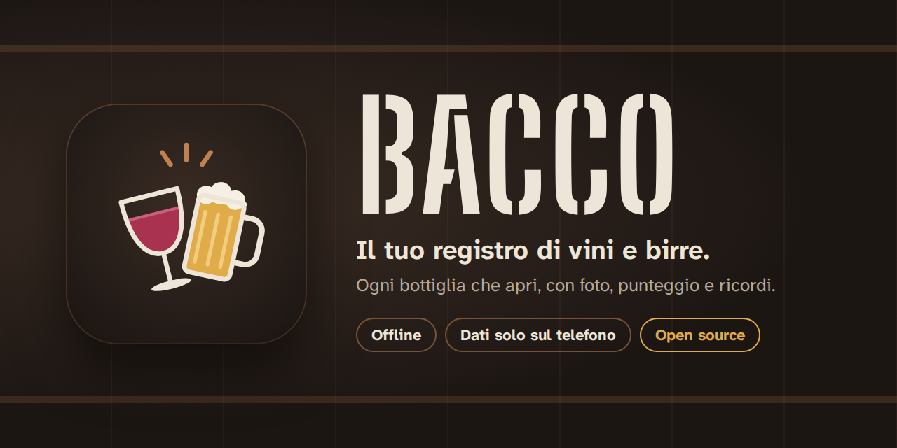
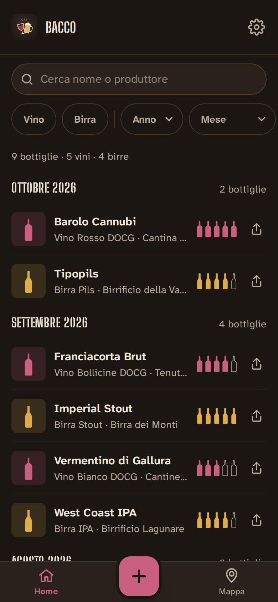
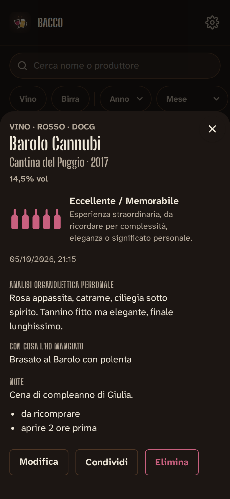
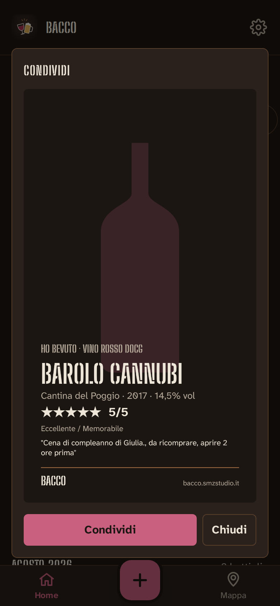
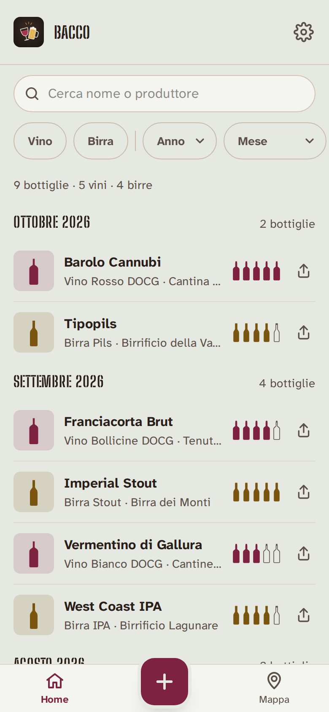
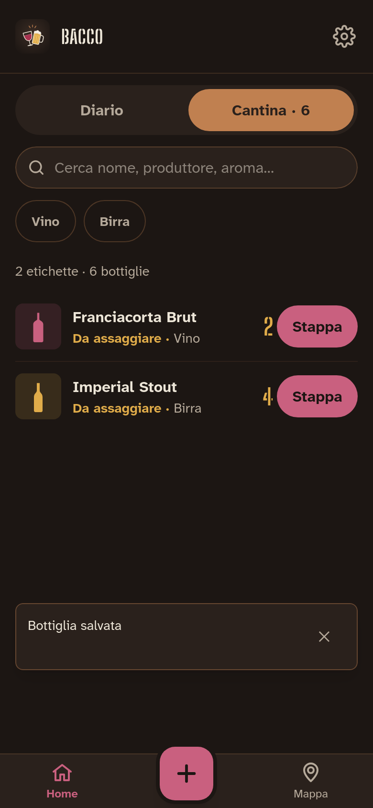
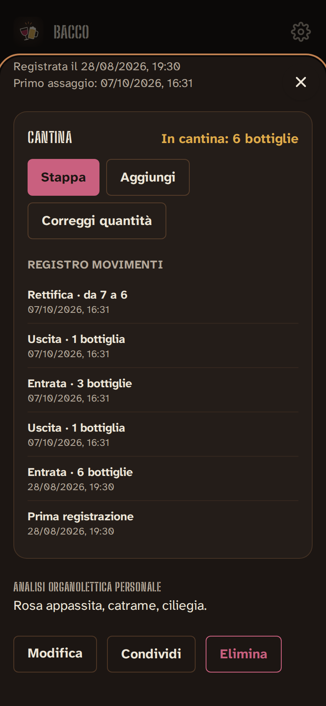

# Bacco

<p align="center">
  
</p>

[](https://github.com/savez/bacco/actions/workflows/ci.yml)
[](https://github.com/savez/bacco/releases)
[](https://bacco-8in8.onrender.com)
[](https://bacco.smzstudio.it/)
[](LICENSE)
[](https://vuejs.org/)
[](https://web.dev/progressive-web-apps/)

**Bacco** è una PWA per tenere il registro personale dei vini e delle birre che bevi:
foto, punteggio, analisi organolettica, abbinamento, luogo e ricordi. Funziona offline e
**i tuoi dati restano sul tuo telefono**: niente account, niente server, niente tracciamento.

🌐 **Sito del progetto**: <https://bacco.smzstudio.it/>

🍷 **App**: <https://bacco-8in8.onrender.com>

<p align="center">
  
  
  
  
</p>

## Cosa fa

- 🍾 **Registra una bottiglia in pochi tocchi**: nome, tipo e punteggio bastano, il resto è facoltativo.
- 📷 **Foto** scattate dall'app o scelte dalla galleria.
- 🍇 **Scheda completa**: sottocategoria (Rosso, Bianco, IPA, Stout…), denominazione
  (DOCG, DOC, IGT, IGP), annata, gradazione, analisi organolettica, abbinamento, note.
- 🏷️ **Contrassegno di Stato**: il codice della fascetta dei vini DOC e DOCG
  (es. ADK007842971), da verificare con l'app ufficiale *Trust your wine* del Poligrafico.
- ⭐ **Punteggio da 1 a 5** con le bottiglie al posto delle stelle e una descrizione per ogni livello.
- 🗂️ **Registro** con ricerca e filtri per tipo, anno e mese.
- 🍷 **Cantina personale**: indica quante bottiglie metti in cantina (0 = la bevi subito);
  punteggio e analisi te li chiede al primo stappo. Filtro "In cantina", registro movimenti
  (entrate, uscite, rettifiche) e "Correggi quantità".
- 🗺️ **Mappa** dei luoghi dove hai bevuto (solo se acconsenti alla posizione).
- 📤 **Card da condividere** sui social, in stile "ho bevuto".
- 💾 **Backup** in JSON (con le foto) e export CSV per i fogli di calcolo, con promemoria ogni 30 giorni.
- 📱 **Installabile** sulla schermata Home e utilizzabile offline.
- 🌗 **Tema chiaro e scuro**, accessibile (WCAG AA), pensato prima di tutto per il telefono.

<p align="center">
  
  
</p>

## Privacy

- Nessun login e nessun server: tutto vive nell'IndexedDB del browser.
- Nessun dato del registro esce dal dispositivo, se non con un backup o una condivisione fatti da te.
- Le uniche richieste di rete sono in sola lettura verso servizi pubblici:
  le tessere di OpenStreetMap per la mappa
  (che riceve solo il codice).
- Fotocamera e posizione vengono chieste solo quando le usi, mai all'avvio.

Dettagli in [SECURITY.md](SECURITY.md).

## Installazione come app

- **Android / Chrome**: menu ⋮ → *Installa app*
- **iPhone / Safari**: Condividi → *Aggiungi alla schermata Home*
- **Desktop**: icona di installazione nella barra degli indirizzi

L'app controlla da sola se c'è una nuova versione; in **Impostazioni → Versione** puoi
cercarla e installarla subito con *Cerca aggiornamenti*.

## Sviluppo

Serve solo **Docker** (con `docker compose`): Node 24 gira nei container.

```bash
git clone https://github.com/savez/bacco.git
cd bacco
docker compose up dev            # http://localhost:5173
```

| Comando                                   | Cosa fa                                                |
| ----------------------------------------- | ------------------------------------------------------ |
| `docker compose up dev`                   | Server di sviluppo con ricaricamento automatico        |
| `docker compose exec dev npm run lint`    | ESLint                                                 |
| `docker compose exec dev npm test`        | Test Vitest                                            |
| `docker compose exec dev npm run build`   | Build di produzione in `dist/`                         |
| `docker compose up --build web`           | PWA di produzione con nginx su :8080 (HTTP) e :8443 (HTTPS) |

Per provarla dal telefono in rete locale (HTTPS con certificato `mkcert`) vedi
[CONTRIBUTING.md](CONTRIBUTING.md#provare-dal-telefono).

**Stack**: Vue 3, Vue Router, Tailwind CSS 4, Dexie (IndexedDB), vite-plugin-pwa (Workbox),
Leaflet, Vitest.

## Deploy

La PWA è un sito statico pubblicato su [Render](https://render.com) dal
[blueprint](render.yaml): ogni push su `main` la aggiorna. Le release sono generate da
[release-please](https://github.com/googleapis/release-please) a partire dai
[Conventional Commits](https://www.conventionalcommits.org/it/).

## Contribuire

Leggi [CONTRIBUTING.md](CONTRIBUTING.md). Bug e idee →
[issue](https://github.com/savez/bacco/issues/new/choose); vulnerabilità →
[segnalazione privata](https://github.com/savez/bacco/security/advisories/new).

## Sostieni il progetto

Se Bacco ti piace, [offrimi una birra o un vino](https://buymeacoffee.com/goeokwihgz) 🍺🍷

## Licenza

[MIT](LICENSE) © Saverio Menin.
mappe © [OpenStreetMap](https://www.openstreetmap.org/copyright) contributors.
